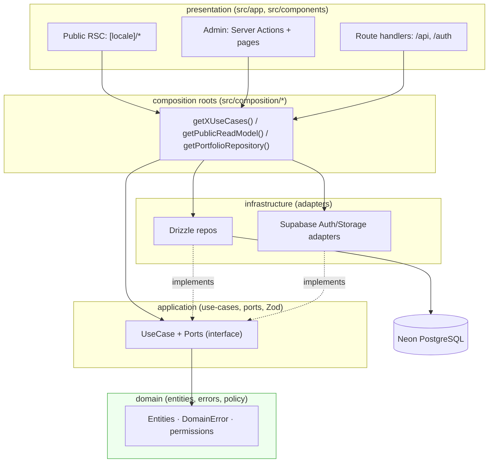

# 🧠 Project Understanding — portfolio_Van_Tho

> **Knowledge map toàn dự án.** Áp dụng phương pháp của skill *Understand-Anything*
> (https://github.com/Egonex-AI/Understand-Anything) **natively** — không cài plugin (plugin cần
> `/plugin marketplace add` tương tác hoặc `curl|bash`, bị CLAUDE.md §26 chặn; Owner đã chọn "vẽ
> natively"). Thay cho `.ua/knowledge-graph.json` + dashboard, tài liệu này là **graph dạng văn bản**:
> node (module/file/use-case/port/repo), edge (phụ thuộc), layer, luồng dữ liệu, quy trình nghiệp vụ,
> và "guided tours". Sinh từ **inventory thực tế** của cây `src/`, không bịa.
>
> Bổ trợ: [`SYSTEM_MAP.md`](SYSTEM_MAP.md) (ERD + Mermaid infra/data/BE) · [`REPORTS_INDEX.md`](../ai/REPORTS_INDEX.md) (bản đồ báo cáo).
> **Trạng thái (2026-08-16): `main` @ `feeb0bd` — ✅ V1 merged, Production LIVE** (`portfolio-van-tho.vercel.app`).
> Inventory dưới đây từ **machine scan mới** trên `src/` hiện tại (271 file .ts/.tsx).

---

## 0. Bức tranh 30 giây

`portfolio_Van_Tho` là **modular monolith** trên Next.js 16 App Router, Clean Architecture nghiêm ngặt.
- **1 backend authority:** Next.js (Vercel). **1 primary DB:** Neon PostgreSQL. **Supabase:** chỉ Auth (GitHub OAuth) + Storage. **Cloudflare:** DNS + Turnstile.
- **13 feature module** dưới `src/modules/<name>/{domain,application,infrastructure,presentation}` + shared kernel + composition roots.
- **Hai mặt phẳng runtime:** (1) **Public** đọc live Neon (chỉ published/visible) qua `NeonPortfolioRepository`; (2) **Admin** ghi qua Server Action → use-case → repo (deny-by-default, row_version, audit).
- Enforce ranh giới bằng `pnpm test:architecture` (10/10). Presentation **không bao giờ** import Drizzle.

---

## 1. Scanner — Inventory (node tổng)

| Nhóm node | Số lượng | Vị trí |
|---|---|---|
| Feature modules | **13** | `src/modules/*` (articles, audit, career, identity, media, profile, projects, public-portfolio, revisions, site-settings, skills, tags, technologies) |
| Composition roots | **14** | `src/composition/*.ts` (13 module + `public-read.ts` hợp nhất) |
| Application ports (interface) | **15** | `src/modules/*/application/ports/*.ts` |
| Use-case files | **13** | `src/modules/*/application/use-cases/*.ts` |
| Drizzle repositories (infra) | **12** | `src/modules/*/infrastructure/drizzle-*.ts` |
| DB schema tables | **25** | `src/infrastructure/database/schema/*.ts` |
| Public routes (`[locale]`) | **8** | `src/app/[locale]/*` |
| Admin areas | **15** | `src/app/admin/*` |
| Boundary routes | **3** | `/admin-login`, `/auth/{callback,error}`, `/api/media/upload-url` |
| Tests | unit **22** · integration(gated) **6** · arch **2 file/10 test** · e2e **5** | `tests/*` |

Shared: `src/shared/{application,domain,i18n.ts,types}` (kernel framework-free) ·
`src/infrastructure/{database,logging,supabase}` (cross-cutting).

---

## 2. Architecture Analyzer — Layer graph & edge

**Luật edge (bất biến, test enforce):**
- `domain → (không gì framework/provider)`; `application → domain + ports/DTO`; `infrastructure → implements ports`; `presentation → composition roots` (KHÔNG chạm Drizzle).
- Kiểm chứng: `tests/architecture/*` (10 test) + ESLint import rules + dependency-cruiser.

---

## 3. File Analyzer — Node chủ chốt (đọc để hiểu nhanh)

**Shared kernel**
- `src/shared/domain/result.ts` — `Result<T,E>` (`ok/err/isOk/isErr`) — kiểu trả về của mọi use-case.
- `src/shared/domain/locale.ts` + `src/shared/i18n.ts` — `Locale = "vi"|"en"`, `Localized<T>`, `pick()`.
- `src/modules/identity/domain/permissions.ts` — quyền (`content.read/write/publish`, `media.write`, `messages.read`, `settings.write`, `audit.read`); `owner_admin` có tất cả.

**Identity / Auth (node trung tâm bảo mật)**
- `src/modules/identity/domain/entities/admin-user.ts` — `AdminUser`.
- `src/modules/identity/application/use-cases/bootstrap-owner-admin.ts` — cấp owner lần đầu (allow-list gated, idempotent, fail-closed).
- `src/modules/identity/infrastructure/drizzle-app-user-repository.ts` — `provisionOwner` (upsert theo `supabase_auth_user_id`).
- `src/composition/identity.ts` — wiring; `src/app/auth/callback/route.ts` gọi `bootstrapOwnerAdmin()` sau `exchangeCodeForSession`.
- `src/middleware.ts` — gate `/admin` + locale routing (defense-in-depth; authz kiểm lại ở admin layout).

**Public read (mặt phẳng đọc)**
- `src/composition/public-read.ts` — `getPublicReadModel()`: hợp nhất read của projects/career/skills/settings/profile (chỉ published/visible/public/non-deleted).
- `src/modules/public-portfolio/infrastructure/neon-portfolio-repository.ts` — **anti-corruption adapter**: map read model → view-contract Wave-04 (vi/en zip; section-kind→case-study; `sample=false`). **Runtime authority.**
- `src/composition/public-portfolio.ts` — bind `PortfolioRepository → NeonPortfolioRepository` (fixtures chỉ còn cho test).

**Admin write (mặt phẳng ghi)**
- `src/app/admin/_lib/admin-action.ts` — `withAdminAction(run)` (deny-by-default, không lộ lỗi DB thô).
- `src/app/admin/_lib/form-state.ts` — `FormState` (client-safe) + helpers.
- Mỗi vùng: `src/app/admin/<area>/{page,actions}.tsx` → `src/composition/<module>.ts` → `use-cases/*` → `drizzle-*.ts`.

---

## 4. Domain Analyzer — Quy trình nghiệp vụ (business flows)

**F1 · First-login owner bootstrap**
`/admin-login` → Supabase GitHub OAuth → `/auth/callback` → `exchangeCodeForSession` → `bootstrapOwnerAdmin()` → nếu email ∈ `ADMIN_ALLOWED_EMAILS`: `provisionOwner` upsert `app_users`(owner_admin/active) → redirect `/admin`. Ngoài allow-list → fail-closed. *(Đã LIVE-verified: 1 owner_admin row.)*

**F2 · Public read (visitor)**
`GET /[locale]/projects` (RSC, `force-dynamic`) → `getPortfolioRepository().listProjects()` → `NeonPortfolioRepository` → `getPublicReadModel().listPublishedProjects(vi&en)` → Drizzle `SELECT ... WHERE status='published' AND visibility='public' AND deleted_at IS NULL` → map `Localized` → HTML. **Không lộ** draft/private/archived/audit/revisions/messages. *(E2E 9/9 + live smoke.)*

**F3 · Admin mutation (ví dụ: publish project)**
Form → Server Action → `withAdminAction` (`getCurrentAdmin`) → composition → use-case (authz deny-by-default + Zod) → repo `UPDATE ... WHERE row_version = expected` (`db.batch` atomic) → outcome `updated|not_found|stale` → `audit.record` → `revalidatePath` → `FormState`. Xung đột đồng thời → lỗi có kiểu `stale` (không ghi đè mù).

**F4 · Revision snapshot**
Publish/update nội dung → append `content_revisions` (đa hình, `version=max+1`, snapshot bất biến) — tách biệt `audit_logs` (who/when).

**F5 · Signed media upload**
`POST /api/media/upload-url` → verify admin + `media.write` + bucket + path + MIME + size → cấp signed URL (server-mediated; service key không ra browser; SVG mặc định cấm).

---

## 5. Tour Builder — Lộ trình đọc code (guided tours)

- **Tour A — "Hiểu auth":** `permissions.ts` → `admin-user.ts` → `bootstrap-owner-admin.ts` → `drizzle-app-user-repository.ts` → `auth/callback/route.ts` → `middleware.ts`.
- **Tour B — "Public đọc live Neon":** `public-portfolio.ts` → `neon-portfolio-repository.ts` → `public-read.ts` → `drizzle-portfolio-repository.ts` → `app/[locale]/projects/page.tsx`.
- **Tour C — "Admin ghi an toàn":** `admin/_lib/admin-action.ts` → `admin/projects/actions.ts` → `composition/projects.ts` → `projects/application/use-cases/*` → `drizzle-portfolio-repository.ts`.
- **Tour D — "Mô hình dữ liệu":** `schema/enums.ts` → `schema/projects.ts` (+ children) → `SYSTEM_MAP.md` §3 ERD.
- **Tour E — "Kiểm chứng ranh giới":** `tests/architecture/*` → `docs/architecture/dependency-rules.md`.

---

## 6. Graph Reviewer — Độ phủ & khoảng trống

**Đã phủ (LIVE-verified, Production):** 13 module application · public live-Neon read **populated với nội dung CV thật** (profile/Education/15 skills/6 tech/Expense Tracker) · admin control plane 15 vùng với **live authenticated session** · auth owner_admin · DB 25 bảng/ledger 6 · **public E2E 7/7** + authed E2E pass · **Vercel Production LIVE + Preview green + CI green** trên `main` @ `feeb0bd`.
**Khoảng trống có chủ đích (không phải lỗi):**
- `contact_messages`, `media_assets` có bảng nhưng **chưa có backend ghi** (contact write-boundary/Turnstile/email = backlog; media attach UI sau).
- `#career` chỉ hiện Education; **Experience cố ý vắng** (`PENDING_OWNER_EXPERIENCE_DETAILS` — không fabricate).
- **Chưa proven:** monitoring/rollback/observability (Wave 07/10); Cloudflare DNS/Turnstile; preview-branch-per-PR.
- ⚠️ `PRODUCTION_DATABASE_TARGET = SAME_AS_DEVELOPMENT` (STOP mở — Owner quyết tách prod DB).

---

## 7. Where-to-find (feature → file)

| Muốn sửa/hiểu | Vào đây |
|---|---|
| Quyền & vai trò | `identity/domain/permissions.ts` |
| Đăng nhập/bootstrap owner | `auth/callback/route.ts`, `identity/**/bootstrap-owner-admin.ts` |
| Trang công khai lấy data | `composition/public-read.ts`, `public-portfolio/infrastructure/neon-portfolio-repository.ts` |
| Thêm trường vào project | `schema/projects.ts` + `projects/**` + `neon-portfolio-repository.ts` (map) |
| Form admin + validate | `app/admin/<area>/actions.ts` + `<module>/application/*-schema.ts` (Zod) |
| ERD / luồng hạ tầng | `docs/architecture/SYSTEM_MAP.md` |
| Trạng thái/tiến độ dự án | `docs/ai/REPORTS_INDEX.md` |

---
*Phương pháp Understand-Anything áp dụng natively (bản đọc-được, an toàn governance).*

> **Understand-Anything refresh (2026-08-16, post-V1):** áp dụng **natively** (Owner-chosen method, không
> cài plugin — CLAUDE.md §26). Machine scan mới trên `main` @ `feeb0bd`: **271 file .ts/.tsx** dưới `src/`
> (giảm 2 so với 273 tiền-V1 = đúng 3 section component Focus/Principles/Articles đã xóa), **13 module · 14
> composition root · 15 port · 13 use-case · 12 repo · 25 bảng · 8 public page · 15 admin area · 2 boundary
> route · 5 e2e**. Layer graph = 4 tầng Clean Architecture + composition (bất biến, arch test 10/10). Guided
> tours = 5 (A–E, §5). Bản `.ua/knowledge-graph.json` tương tác **KHÔNG tái sinh phiên này** — số node/edge
> plugin cũ (567/591/273) đã **superseded**; tài liệu `.md` native này là authority trong repo. `.ua/` vẫn
> gitignored nếu Owner chọn chạy plugin cục bộ sau.
