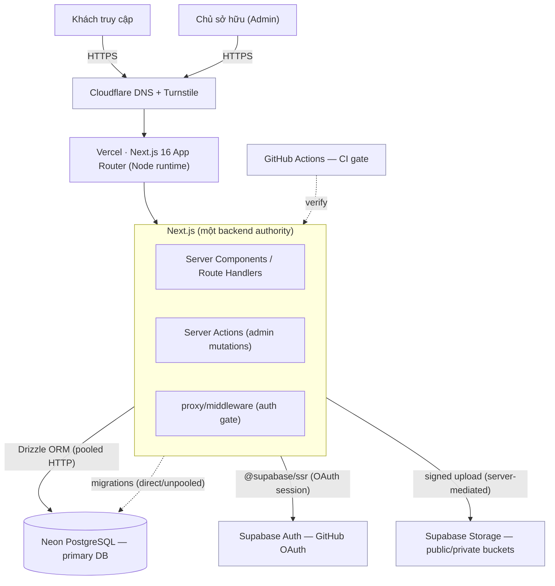
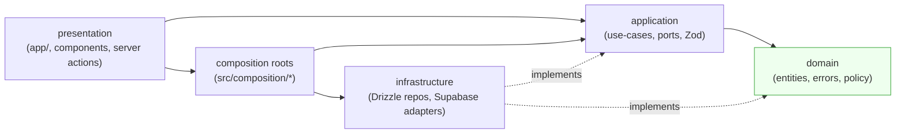
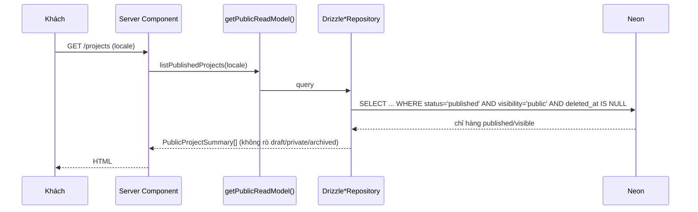
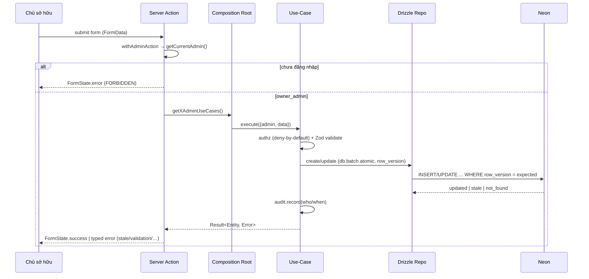
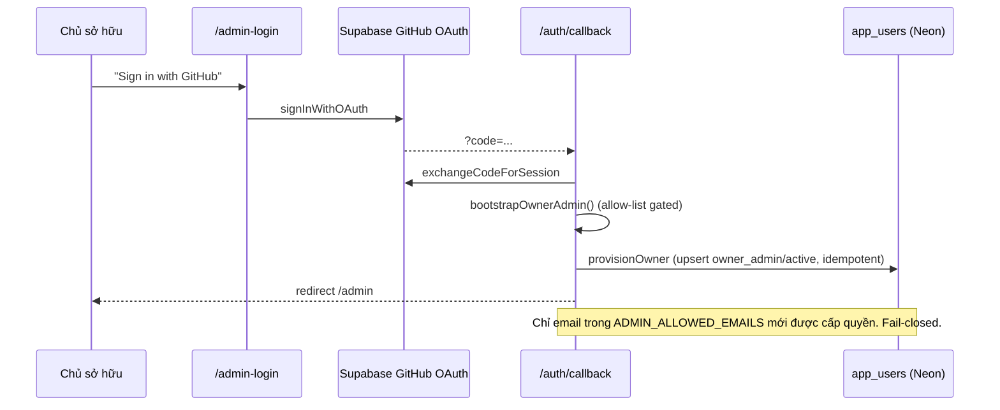

# Bản đồ hệ thống — portfolio_Van_Tho

> Sơ đồ toàn dự án: **Cơ sở hạ tầng · Cơ sở dữ liệu (ERD) · Backend (luồng xử lý)**.
> Vẽ **natively** bằng Mermaid (Owner chọn không cài plugin ngoài; nguồn tham khảo
> `Understand-Anything` giữ ở dạng local reference — CLAUDE.md §26). **Cập nhật (2026-08-16): `main` @
> `feeb0bd` — ✅ V1 merged, Production LIVE.** Neon **Development** (production-serving), ledger = 6, 25 bảng.

Xem trực tiếp trên GitHub (render Mermaid) hoặc bất kỳ trình xem Markdown hỗ trợ Mermaid.

> **LEGEND — phân biệt mục tiêu vs thực tế:**
> `[TARGET]` = kiến trúc mục tiêu (chưa chạy thật). `[LIVE]` = đã kiểm chứng runtime thật.
> **Đã LIVE (Production):** **Vercel Production** (`portfolio-van-tho.vercel.app`, Git-integration deploy
> on push to `main`) · Neon (25 bảng, ledger=6) **production-serving** · Public Neon read model **populated
> với nội dung CV thật** · **GitHub OAuth → `owner_admin` (1 owner, active, verified) + authenticated admin
> session** · **Trang công khai đọc trực tiếp live Neon** (`NeonPortfolioRepository`, single runtime
> authority, không fixture fallback) · **Public E2E 7/7** + authed E2E pass · **CI green** + **Vercel
> Preview green**.
> **Còn TARGET (chưa verify runtime):** monitoring/rollback/observability (Wave 07/10) · Cloudflare
> DNS/Turnstile · preview-branch-per-PR. ⚠️ `PRODUCTION_DATABASE_TARGET = SAME_AS_DEVELOPMENT` (STOP mở).

---

## 1. Cơ sở hạ tầng (topology)



**Ranh giới quyền lực:** Next.js/Vercel = backend authority duy nhất · Neon = primary DB duy
nhất · Supabase = chỉ Auth + Storage · Cloudflare = DNS + Turnstile · GitHub Actions = CI.
**Vercel Production + Preview đã LIVE** (deploy on push to `main`). Cloudflare DNS/Turnstile +
monitoring/rollback/observability **chưa** kích hoạt (Owner-deferred, Wave 07/10).

---

## 2. Clean Architecture (ràng buộc phụ thuộc)



- `domain` không import framework/infra/`process.env`. `application` chỉ dùng ports/DTO/domain.
- `infrastructure` hiện thực ports. `presentation` gọi **composition roots**, không chạm Drizzle
  trực tiếp. Kiểm chứng bằng `pnpm test:architecture` (10/10 xanh).

---

## 3. ERD — 25 bảng (Neon Development)

```mermaid
erDiagram
  app_users {
    uuid id PK
    uuid supabase_auth_user_id "external ref (no cross-db FK)"
    text email
    enum role "owner_admin|editor|viewer"
    enum status
    int row_version
  }
  profiles {
    uuid id PK
    text singleton_key "unique 'primary'"
    text full_name
    text professional_title
  }
  projects {
    uuid id PK
    text slug
    enum status "draft|review|published|archived"
    enum visibility "public|private|unlisted"
    uuid cover_media_id FK "setnull"
    int row_version
    timestamptz deleted_at
  }
  project_translations { uuid id PK; uuid project_id FK; text locale }
  project_sections { uuid id PK; uuid project_id FK; enum kind; bool is_visible }
  project_section_translations { uuid id PK; uuid section_id FK; text locale }
  project_technologies { uuid id PK; uuid project_id FK; uuid technology_id FK }
  project_media { uuid id PK; uuid project_id FK; uuid media_id FK }
  project_links { uuid id PK; uuid project_id FK; enum link_type }
  project_metrics { uuid id PK; uuid project_id FK; text label }
  technologies { uuid id PK; text slug; enum category; timestamptz deleted_at }
  tags { uuid id PK; text slug; timestamptz deleted_at }
  articles {
    uuid id PK
    text slug
    enum status "draft|published|archived"
    uuid cover_media_id FK "setnull"
    int row_version
    timestamptz deleted_at
  }
  article_translations { uuid id PK; uuid article_id FK; text locale }
  article_tags { uuid id PK; uuid article_id FK; uuid tag_id FK "RESTRICT" }
  experiences { uuid id PK; date start_date; bool is_visible; int row_version; timestamptz deleted_at }
  experience_translations { uuid id PK; uuid experience_id FK; text locale }
  education { uuid id PK; text institution; bool is_visible; int row_version; timestamptz deleted_at }
  certifications { uuid id PK; text name; bool is_visible; int row_version; timestamptz deleted_at }
  skills { uuid id PK; text slug; bool is_visible }
  site_settings { text key PK; jsonb value_json; bool is_public }
  media_assets { uuid id PK; text bucket; text object_path; text mime_type }
  contact_messages { uuid id PK; text email; enum status; bool turnstile_verified }
  audit_logs { uuid id PK; uuid actor_user_id; text action; text entity_type; jsonb metadata_json }
  content_revisions {
    uuid id PK
    text content_type "polymorphic (no FK)"
    uuid content_id
    int version
    uuid actor_user_id FK "setnull"
    jsonb snapshot
  }

  projects ||--o{ project_translations : has
  projects ||--o{ project_sections : has
  project_sections ||--o{ project_section_translations : has
  projects ||--o{ project_technologies : has
  technologies ||--o{ project_technologies : used_by
  projects ||--o{ project_media : has
  media_assets ||--o{ project_media : referenced_by
  projects ||--o{ project_links : has
  projects ||--o{ project_metrics : has
  media_assets |o--o{ projects : cover
  articles ||--o{ article_translations : has
  articles ||--o{ article_tags : has
  tags ||--o{ article_tags : classifies
  media_assets |o--o{ articles : cover
  experiences ||--o{ experience_translations : has
  app_users |o--o{ content_revisions : actor
```

**Ghi chú quan hệ:** `article_tags.tag_id` = **RESTRICT** (không xoá tag đang được dùng);
`*_media`/cover = **SET NULL**; các bảng con dịch/translation = **CASCADE**; `content_revisions`
đa hình (không FK tới thực thể) — append-only, bất biến; `app_users.supabase_auth_user_id` là
tham chiếu ngoài (không FK cross-DB tới Supabase).

---

## 4. Luồng ĐỌC công khai (visitor → Neon)



Bất biến: read model **chỉ** trả published/visible/public/non-deleted — chứng minh bằng 6 live
smoke (draft/archive leak = 0).

---

## 5. Luồng GHI của Admin (mutation an toàn)



Mọi mutation: **authenticate → authorize → validate → use-case → repo → audit**. UI không chạm
Drizzle. Xung đột `row_version` hiện ra dưới dạng lỗi có kiểu (không ghi đè mù).

---

## 6. Luồng Auth + bootstrap chủ sở hữu



Trạng thái hiện tại `[LIVE]`: Owner đã hoàn tất GitHub OAuth; `bootstrapOwnerAdmin` đã cấp
**1 hàng `app_users` = `owner_admin` / `active`**, có liên kết Supabase UID, `last_login` hiện
diện, `credentials_revoked_at` = null. Kiểm chứng read-only (đã che định danh) trực tiếp trên
Neon → `OWNER_ADMIN_DEV_AUTH_VERIFIED`. Chuỗi negative (chưa đăng nhập / user lạ / inactive /
role không hỗ trợ → DENY) đã chứng minh bằng unit test.

---

## 7. Báo cáo DB theo nhóm module

| Nhóm | Bảng | Cơ chế chính |
|---|---|---|
| Identity | `app_users` | ngoại-ref Supabase UID; role/status; row_version |
| Profile | `profiles` | singleton `primary` (upsert) |
| Projects | `projects` (+7 con) | status+visibility; batch tx; row_version; cover setnull; tech RESTRICT-free |
| Taxonomy | `technologies`, `tags` | slug unique; soft-delete; RESTRICT khi tag được bài viết dùng |
| Articles | `articles` (+2 con) | status; batch tx; row_version; `article_tags`→tags RESTRICT |
| Career | `experiences`(+trans), `education`, `certifications` | is_visible gate; soft-delete; row_version; ISO date |
| Skills | `skills` | flat; is_visible; hard delete |
| Settings | `site_settings` | KV jsonb; is_public gate |
| Media | `media_assets` | bucket/path/MIME; signed upload |
| Contact | `contact_messages` | (backend Wave 06) |
| Audit | `audit_logs` | append-only who/when; không bí mật |
| Revisions | `content_revisions` | append-only, đa hình, snapshot bất biến, version=max+1 |

Chi tiết hợp đồng DB: [`WAVE05_DATABASE_CONTRACT.md`](../audit/WAVE05_DATABASE_CONTRACT.md) ·
Kiểm toán backend: [`WAVE05_BACKEND_APPLICATION_AUDIT.md`](../audit/WAVE05_BACKEND_APPLICATION_AUDIT.md).
