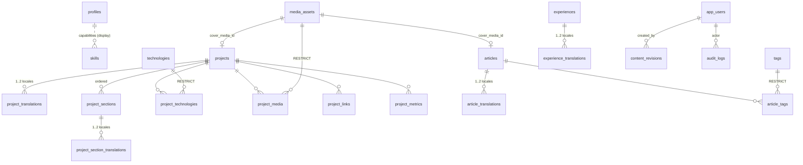

# Database Schema Matrix — CMS Group 0 (Schema Authority Audit)

> Wave 05 CMS foundation · branch `feat/wave-05-cms-foundation` (off verified `main` `f24d1d8`).
> Purpose: design the **full** target CMS schema and reconcile it with the 8 existing kernel tables
> **before** writing any migration. No migration is generated or run in Group 0.
> Target for every future migration: **Neon Development only** (never Production).
> Verdict: `CMS_SCHEMA_ARCHITECTURE_READY_FOR_REVIEW`.

---

## 1. Existing kernel tables (8) — verified on `main`

Source: `src/infrastructure/database/schema/*.ts`; migration ledger `_journal.json` = 1 entry (`0000_boring_skullbuster`).

| Table | Role (authority) | Key columns | Soft delete | row_version |
|---|---|---|---|---|
| `app_users` | Admin identity ↔ Supabase Auth bridge | `supabase_auth_user_id` uq, `email` uq, `role`(app_role), `status`(user_status), `credentials_revoked_at` | no | ✅ |
| `profiles` | Singleton owner profile | `singleton_key` uq, `full_name`, `professional_title`, `location`, `public_email`, `availability_status`, `default_locale` | no | ➖ (add in G4) |
| `projects` | Project root entity | `slug` uq, `status`(project_status), `visibility`(project_visibility), `category`, `featured`/`featured_order`, `role`, `github_url`/`live_url`/`video_url`, `cover_media_id`, `published_at`, `deleted_at` | ✅ | ✅ |
| `media_assets` | **Blob/object authority** (single source of stored files) | `bucket`+`object_path` uq, `mime_type`, `byte_size`, `alt_text`, `visibility`(media_visibility), `upload_status`, `deleted_at` | ✅ | ➖ |
| `skills` | **Capability/proficiency narrative** | `slug` uq, `name`, `category`(free text), `proficiency_label`, `evidence_text`, `display_order`, `is_visible` | no | ➖ |
| `contact_messages` | Contact inbox (Neon = source of truth) | `name`, `email`, `status`(contact_status), `turnstile_verified`, `email_delivery_status`, `read_at`, `archived_at` | no | ➖ |
| `audit_logs` | **Append-only event log** (who/what/when) | `actor_user_id`, `action`, `entity_type`, `entity_id`, `request_id`, `metadata_json` | no | n/a |
| `site_settings` | Key/value settings | `key` PK, `value_json`, `is_public`, `updated_by` | no | ➖ |

Existing enums: `app_role`, `user_status`, `project_status`(draft/review/published/archived), `project_visibility`(public/unlisted/private), `media_visibility`(public/private), `contact_status`(new/read/archived).

---

## 2. Authority reconciliation (the 4 flagged overlaps)

### 2.1 `skills` vs `technologies` — **KEEP BOTH, distinct authority**
- `skills` = owner's **proficiency/evidence narrative** for the Capabilities section (subjective, ordered, `evidence_text`).
- `technologies` (new) = **normalized catalog of concrete tech entities** (brand, devicon key, color, website) used to *tag projects* (`project_technologies`) and render logos. This is the DB home of today's static `src/config/technology-catalog.ts` (23 entries).
- **Resolution:** No merge. `technologies` is the brand/logo + tagging authority; `skills` is the proficiency authority. The static catalog file is kept as the **seed** for `technologies` (Group 1) and as a test fallback. A future `skill_technologies` link is **not** created now (speculative — Karpathy Simplicity).

### 2.2 `media_assets` vs `project_media` — **REFERENCE, not a second store**
- `media_assets` remains the **only** blob authority.
- `project_media` (new) = ordered **junction** (`project_id` → projects, `media_id` → media_assets, `role`, `caption`, `sort_order`). It stores **no** file metadata.
- **Resolution:** `project_media.media_id` FK → `media_assets(id)` **ON DELETE RESTRICT** (reference-aware deletion, CLAUDE.md §14). The existing `projects.cover_media_id` stays the canonical single cover pointer (add FK → media_assets in Group 2); `project_media` handles the gallery/video set.

### 2.3 `audit_logs` vs `content_revisions` — **KEEP BOTH, different purpose**
- `audit_logs` = security/activity **event** stream (not a content copy).
- `content_revisions` (new) = **immutable content snapshots** (`entity_type`, `entity_id`, `version`, `snapshot_json`, `created_by`, `created_at`) enabling restore-preview.
- **Resolution:** No replacement. A publish/update writes **both** an `audit_logs` event and a `content_revisions` snapshot. `content_revisions` has **no** cascade from the entity (snapshots survive soft-delete for restore/audit).

### 2.4 `projects` vs project extensions — **`projects` stays root; text/relations externalized**
- `projects` keeps identity/state/flags. Localized text moves to `project_translations`. Case-study long-form → `project_sections` (+ translations). Typed links → `project_links`. Verified numbers → `project_metrics`. Tech tags → `project_technologies`.
- **Legacy columns:** `github_url`/`live_url`/`video_url` are **superseded** by `project_links` but **NOT dropped** this phase (additive-only rule §12). They are marked **deprecated**; a destructive cleanup migration is a separate, approved step later.

---

## 3. Proposed CMS tables (17) — grouped

Legend: PK = uuid `defaultRandom`; all content tables get `created_at`/`updated_at` timestamptz unless noted.

### Group 1 — Shared content foundations
| Table | Purpose | Key columns | FKs / constraints |
|---|---|---|---|
| `technologies` | Normalized tech catalog + logo authority | `slug` uq, `name`, `category`(technology_category), `devicon_key`, `brand_color`, `website`, `sort_order`, `is_visible`, `deleted_at` | — |
| `tags` | Article/content taxonomy | `slug` uq, `name`, `sort_order`, `deleted_at` | — |

### Group 2 — Projects CMS
| Table | Purpose | Key columns | FKs / constraints |
|---|---|---|---|
| `project_translations` | Localized project text | `project_id`, `locale`, `title`, `tagline`, `summary` | FK→projects CASCADE; uq(`project_id`,`locale`); CHECK locale∈(vi,en) |
| `project_sections` | Ordered case-study blocks | `project_id`, `kind`(project_section_kind), `sort_order`, `is_visible` | FK→projects CASCADE; uq(`project_id`,`kind`) |
| `project_section_translations` | Localized section body | `section_id`, `locale`, `heading`, `body_md` | FK→project_sections CASCADE; uq(`section_id`,`locale`); CHECK locale |
| `project_technologies` | Project↔technology tags | `project_id`, `technology_id`, `sort_order` | FK→projects CASCADE, FK→technologies RESTRICT; uq(`project_id`,`technology_id`) |
| `project_media` | Ordered media references | `project_id`, `media_id`, `role`, `caption`, `sort_order` | FK→projects CASCADE, FK→media_assets RESTRICT |
| `project_links` | Typed external links | `project_id`, `link_type`(project_link_type), `url`, `label`, `sort_order` | FK→projects CASCADE |
| `project_metrics` | **Verified** numbers only | `project_id`, `label`, `value`, `unit`, `evidence_url`, `sort_order` | FK→projects CASCADE |

### Group 3 — Articles CMS
| Table | Purpose | Key columns | FKs / constraints |
|---|---|---|---|
| `articles` | Article root | `slug` uq, `status`(publication_status), `published_at`, `cover_media_id`, `deleted_at`, `row_version` | FK cover→media_assets SET NULL |
| `article_translations` | Localized article body | `article_id`, `locale`, `title`, `summary`, `body_md` | FK→articles CASCADE; uq(`article_id`,`locale`); CHECK locale |
| `article_tags` | Article↔tag | `article_id`, `tag_id` | FK→articles CASCADE, FK→tags RESTRICT; uq pair |

### Group 4 — Profile & career
| Table | Purpose | Key columns | FKs / constraints |
|---|---|---|---|
| `experiences` | Work/role history | `org`, `start_date`, `end_date`(nullable=current), `status`(publication_status), `sort_order`, `deleted_at`, `row_version` | — |
| `experience_translations` | Localized role text | `experience_id`, `locale`, `title`, `summary` | FK→experiences CASCADE; uq(`experience_id`,`locale`); CHECK locale |
| `education` | Education entries | `institution`, `credential`, `start_date`, `end_date`, `sort_order`, `deleted_at` | — |
| `certifications` | Certifications | `name`, `issuer`, `issued_at`, `credential_url`, `sort_order`, `deleted_at` | — |

### Group 5 — Revisions & operations
| Table | Purpose | Key columns | FKs / constraints |
|---|---|---|---|
| `content_revisions` | Immutable content snapshots | `entity_type`, `entity_id`, `version`, `snapshot_json`, `created_by` | uq(`entity_type`,`entity_id`,`version`); FK created_by→app_users SET NULL; **no** cascade from entity |

Reused kernel tables (no recreation): `profiles`, `projects`, `media_assets`, `skills`, `contact_messages`, `audit_logs`, `site_settings`, `app_users`.

---

## 4. Proposed new enums (additive)
- `technology_category` — `language`, `backend`, `frontend`, `data`, `cloud`, `ai`, `tooling` (mirrors static catalog groups).
- `project_section_kind` — `overview`, `problem`, `context`, `role`, `architecture`, `decisions`, `tradeoffs`, `results`, `limitations`, `next_step` (mirrors Wave 04 `ProjectDetail` domain type).
- `project_link_type` — `github`, `demo`, `video`, `docs`, `case_study`, `other`.
- `publication_status` — `draft`, `published`, `archived` (shared by `articles`, `experiences`; `projects` keeps its richer `project_status` which adds `review`).

Locale is enforced by CHECK `locale in ('vi','en')` + Zod at the boundary (matches `src/shared/i18n.ts` `LOCALES`).

---

## 5. Target ERD

`content_revisions` and `audit_logs` reference entities **by (entity_type, entity_id)** (no hard FK) so
snapshots/events survive soft-deletes.

---

## 6. Relationship / policy matrix

| Child | Parent | On delete | Unique | Ordered | Localized | Soft delete |
|---|---|---|---|---|---|---|
| project_translations | projects | CASCADE | (project_id,locale) | — | ✅ | via parent |
| project_sections | projects | CASCADE | (project_id,kind) | sort_order | — | via parent |
| project_section_translations | project_sections | CASCADE | (section_id,locale) | — | ✅ | via parent |
| project_technologies | projects/technologies | CASCADE / RESTRICT | pair | sort_order | — | — |
| project_media | projects/media_assets | CASCADE / **RESTRICT** | — | sort_order | — | via media |
| project_links | projects | CASCADE | — | sort_order | — | — |
| project_metrics | projects | CASCADE | — | sort_order | — | — |
| article_translations | articles | CASCADE | (article_id,locale) | — | ✅ | via parent |
| article_tags | articles/tags | CASCADE / RESTRICT | pair | — | — | — |
| experience_translations | experiences | CASCADE | (experience_id,locale) | — | ✅ | via parent |
| content_revisions | (by entity id) / app_users | none / SET NULL | (entity_type,entity_id,version) | version | — | never |

---

## 7. Migration group plan (additive; Neon Development only)

Each group = one focused migration + vertical slice (schema → generate → SQL review → mapping → repo → use-cases → Zod → authz → tx → audit → tests → build → CI), gated before the next. **Never** one migration with all 17 tables.

| Group | Tables (migration) | Suggested commit | Gate verdict |
|---|---|---|---|
| G1 Shared | `technologies`, `tags` (+ enums used) | `feat(cms): add shared content taxonomy` | ✅ **`CMS_GROUP_1_SHARED_TAXONOMY_DEV_VERIFIED`** — migration `0001_damp_warstar.sql` applied to Neon Dev (ledger=2); tables/enum/indexes/unique/enum-constraint + insert/read/update/dup-reject/cleanup smoke PASS |
| G2 Projects | project_translations/sections/section_translations/technologies/media/links/metrics + enums; add FK `projects.cover_media_id`→media_assets | `feat(cms): add project content model` + `feat(cms): add project write workflows` | `CMS_GROUP_PROJECTS_DEV_VERIFIED` |
| G3 Articles | `articles`, `article_translations`, `article_tags` | `feat(cms): add article content model` | `CMS_GROUP_ARTICLES_DEV_VERIFIED` |
| G4 Career | `experiences`, `experience_translations`, `education`, `certifications`; add `profiles.row_version` | `feat(cms): add profile career content` | `CMS_GROUP_CAREER_DEV_VERIFIED` |
| G5 Revisions | `content_revisions` | `feat(cms): add immutable content revisions` | `CMS_GROUP_REVISIONS_DEV_VERIFIED` |

Final phase verdict after all gates: `CMS_FOUNDATION_DEV_PREVIEW_VERIFIED`.

## 8. Migration safety (unchanged authority — §11/§12)
- `TARGET_PROVIDER=NEON`, `TARGET_ENVIRONMENT=DEVELOPMENT`, must prove `TARGET_IS_NOT_PRODUCTION` before any `migrate`.
- Additive only: no `DROP`/`TRUNCATE`/destructive `ALTER`; no `drizzle-kit push`, no reset, no auto down-migration, no Production connection.
- `drizzle-kit generate` is offline (schema only). Ledger currently 1 entry — each group appends exactly one.
- Migration fail → keep evidence, root-cause, fix source, reconcile Dev DB, re-run on Dev only.

## 9. Open gate items to resolve BEFORE Group 1 (need Owner/next-step confirmation)
1. **Public Neon repository needs Wave 04 ports.** `DrizzlePortfolioRepository` must satisfy the `PortfolioRepository` port that currently lives only on the **unmerged** `feat/wave-04-public-portfolio` branch. Since merging PR #5 auto-deploys Production (locked), options: (a) branch a Wave-04→Wave-05 **integration branch** locally for Dev/Preview only, (b) reconstruct the port interface on this branch, or (c) build write-side + admin first and wire the public Neon repo last. Proposed: **(a)** integration branch for Dev/Preview, no Production merge. → decide at Group 1.
2. **Legacy URL columns** (`projects.github_url/live_url/video_url`) kept vs migrated into `project_links`. Proposed: keep (deprecated) this phase; destructive cleanup later.
3. **`publication_status` shared enum** vs per-table enums. Proposed: shared enum (articles + experiences); projects keeps `project_status`.
4. **Seeding `technologies`** from the static catalog (23 entries) — real, non-fabricated, Owner-verified tech only.
